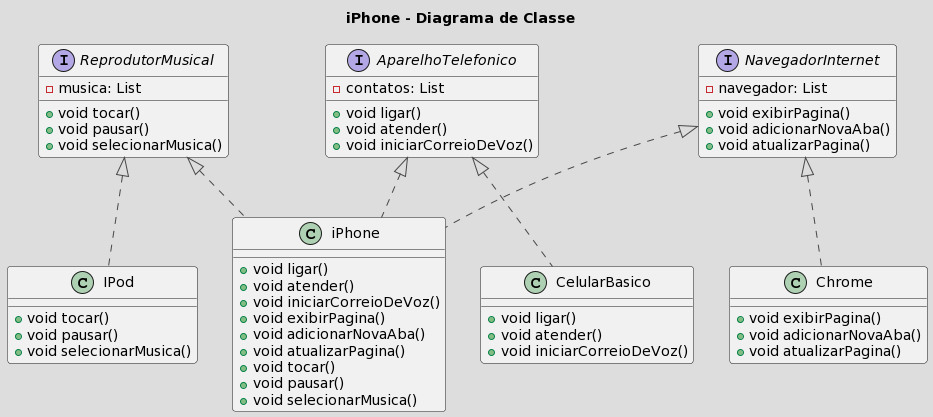

# Trilha Java Básico
#### prof: gleyson sampaio

### [metodos] Exercicio

```

Criar um exemplo de uma classe para representar uma SmartTV onde:

1. tenha caracteristicas: ligada (boolean), canal (int), volumec(int)
2. nossa tv podera ligar e desligar e assim mudar o estado ligada
3. nossa tv aumentara e diminuira o volume sempre +1 ou -1
4. nossa tv podera mudar de canal de 1 em 1 ou definindo o numero correspondente

```

### [SINTAXE] Desafio


Exercitar o conteúdo apresentado no módulo de Sintaxe codificando o seguinte cenário.

1. Crie o projeto ContaBanco que receberá dados via terminal contendo as características de conta em banco conforme atributos abaixo:
2. Dentro do projeto, crie a classe ContaTerminal.java para realizar toda a codificação do nosso programa.

| Atributo  | Tipo   | Exemplo
| ------- | -------- | -------- |
| Numero   | Inteiro    | 1021
| Agencia   | Texto    | 067-8
| Nome Cliente   | Texto    | MARIO ANDRADE
| Saldo   | Decimal    | 237.48

3. Permita que os dados sejam inseridos via terminal sendo que o usuário receberá a mensagem de qual informação será solicitada, exemplo:
- Programa: "Por favor, digite o número da Agência !"
- Usuário: 1021 (depois ENTER para o próximo campo)

4. Depois de todas as informações terem sido inseridas, o sistema deverá exibir a seguinte mensagem:

"Olá [Nome Cliente], obrigado por criar uma conta em nosso banco, sua agência é [Agencia], conta [Numero] e seu saldo [Saldo] já está disponível para saque".

Os campos em [ ] devem ser alterados pelas informações que forem inseridas pelos usuários.

---------

### [estruturas condicionais] Exercicio

```

Case 1: Vamos imaginar que em um processo seletivo, existe o valor base salarial de R$ 2.000,00 e o salário pretentido pelo candidato. Vamos elaborar um controle de fluxo onde:
- Se o valor salário base, for maior que valor salário pretentido, imprima : LIGAR PARA O CANDIDATO;
- Senão, Se o valor salário base for igual ao valor salário pretentido, imprima : LIGAR PARA O CANDIDATO, COM CONTRA PROPOSTA;
- Senão imprima: AGUARDANDO RESULTADO DOS DEMAIS CANDIDATOS.

Case 2: Foi solicitado, que nosso sistema garanta que, diante das inúmeras candidaturas sejam selecionados apenas no máximo, 5 candidatos para entrevista, onde o salário pretendido seja menor ou igual ao salário base.

// Array com a lista de candidatos
String [] candidatos = {"FELIPE","MÁRCIA","JULIA","PAULO","AUGUSTO","MÔNICA","FABRÍCIO","MIRELA","DANIELA","JORGE"};

Case 3: Agora é hora de imprimir a lista dos candidatos selecionados, para disponibilizar para o RH entrar em contato.

Case 4: O RH deverá realizar uma ligação, com no máximo 03 tentativas para cada candidato selecionado e caso o candidato atenda, deve-se imprimir:
- "CONSEGUIMOS CONTATO COM _[CANDIDATO] ``` APÓS **_**[TENTATIVA]`** TENTATIVA(S)";
- Do contrário imprima: "NÃO CONSEGUIMOS CONTATO COM O _[CANDIDATO]_".

```

### [CONTROLE DE FLUXO] Desafio

### [iPHONE] Desafio

[Video Lancamento iPhone](https://www.youtube.com/watch?v=9ou608QQRq8)

Com base no vídeo de lançamento do iPhone conforme link abaixo, elabore em uma ferramenta de UML de sua preferência. 
A diagramação das classes e interfaces com a proposta de representar os papéis do iPhone de: Reprodutor Musical, 
Aparelho Telefônico e Navegador na Internet. 
Em seguida crie as classes e interfaces no formato de arquivos .java

### Diagrama criado para o desafio
